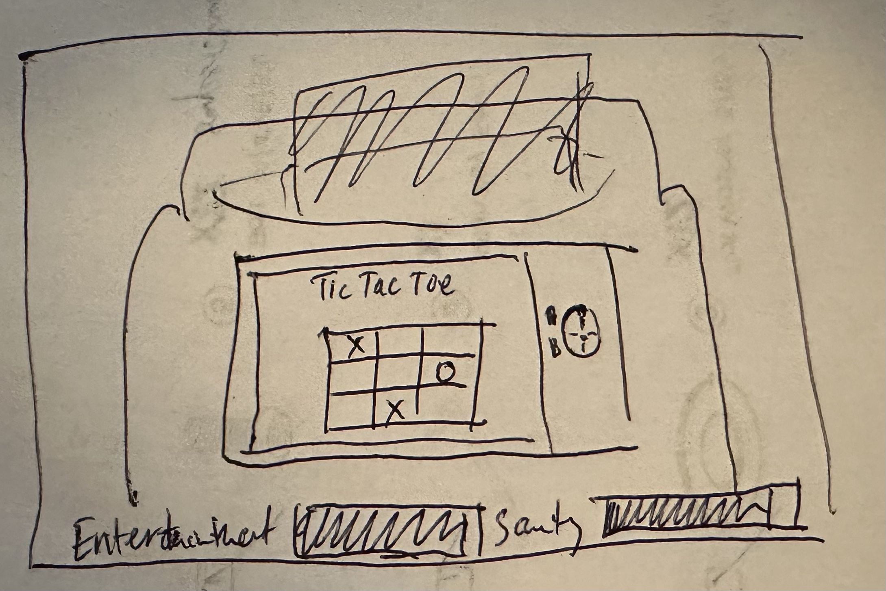

# Passenger.k

# Description:
Inspired by the mundane, this gameplay explores the experience of a passenger on a plane whose flight is getting delayed repeatedly.  The passenger will have to solve puzzles and complete additional time-based tasks, and NPC interactions, all while keeping themselves entertained and their sanity level high. As their sanity level goes down, the game will get increasingly more difficult as they response options will have bigger impacts on their meters, making it more difficult to get to take-off successfully. Survive the plane delays and successfully take off, or die in several creative ways. Enjoy exploring all the possible outcomes!

## Technologies:
- JavaScript
- HTML
- CSS
- Canvas

## User Stories:
### As a user, I want the ability to:
- Interact with armrest-type controls on the screen to control the seatback-TV
- Pass a series of interactions that solves a puzzle
- View the latest ETA
- Text my family members when my phone pops up to tell them the latest ETA
- Solve puzzles to increase my entertainment meter - (e.g., win tic-tac-toe against AI)
- Read travel updates from the pilot
- Read and respond to dialogue from passengers and flight attendants
- Make choices in dialogue to impact sanity and entertainment meters
- Win by solving all the puzzles and taking off with high enough entertainment & sanity levels
- Die of boredom by letting enterainment meter run out
- Get kicked-off the plane due to increasingly aggressive interactions with passengers and/or flight attendant
- Get left at the airport because my family members don't know when I'm arriving
- Look to the left, right, top and bottom of the seatback in front of me to interact with more objects and/or passengers
- Read a unique message when you win or lose in one of the several creative ways and restart from the beginning

## Wireframes:

