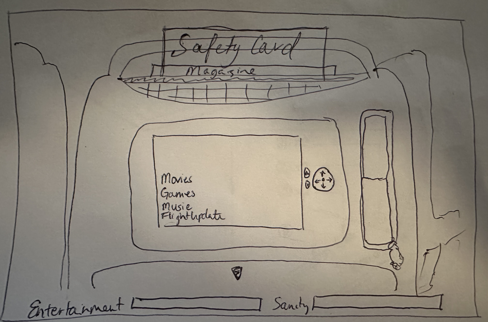
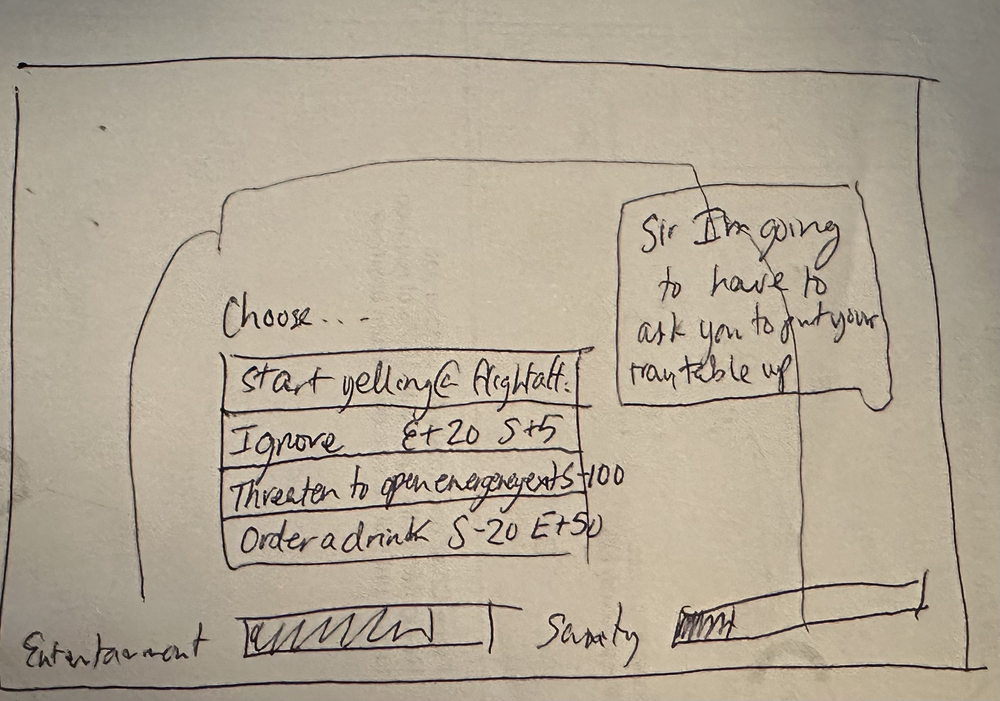

# Passenger.k

# Description:
Inspired by the mundane, this gameplay explores the experience of a passenger on a plane waiting for their flight to take off. This is a time-based point & click adventure designed to be played multiple times, each time trying a different set of actions to see how they effect the outcome. The player will interact with the seatback in front of them, solve puzzles, and complete NPC interactions, all while keeping themselves entertained and their sanity level high. Keep an eye on how each action (or reaction) impacts entertainment, sanity, and departure meters, and modify your approach next time to see if you can generate a different outcome. Try to make it to your departure time without dying of boredom or losing all of your sanity! Enjoy exploring all the possible outcomes!

## User instructions:
- Currently only compatible with Chrome on Desktops/Laptops, and for use with mouse/pointer
- Number one rule in any point-and-click is to explore the screen! SPOILER alerts below!
- Interactable elements:
    - Before boarding the plane:
        - Development In Progress - 
            - Safety Instructions (Open game instructions)
            - Credits (Open game credits)
        - Board Plane button (starts game)
    - Navigator & Select buttons on console (Control console screen)
        - Maybe the screen wouldn't look so old if people didnt assume it was a touchscreen!!
    - Safety Instructions Card (Opens safety puzzle)
        - SPOILERS (Hints if needed)
            - ** If you get stuck on the safety card - click around several times to reset the puzzle & try again later
            - ** Pay attention to the screen and clues to see what should go where - each box should have one item from the left panel and one item from the right panel
    - Volume Up/Down buttons (to control overall volume of game)
    - Tray Table
    - Other SPOILERS:
        - Phone - when ringing
        - Reaction buttons during NPC interactions

## Technologies:
- JavaScript
- HTML
- CSS
- Canvas

## User Stories:
### As a user, I want the ability to:
- Interact with navigation controls on the screen to control the seatback-TV
- Pass a series of interactions that solves a puzzle
- View the latest departure time
- Text my family members when my phone pops up to tell them the latest ETA
- Solve puzzles to increase my entertainment meter - (e.g., win tic-tac-toe against AI)
- Read and respond to dialogue from passengers and flight attendants
- Make choices in dialogue to impact sanity and entertainment meters
- Win by solving puzzles and taking off with high enough entertainment & sanity levels
- Die of boredom by letting enterainment meter run out
- Read a unique message when you win or lose in one of the several creative ways and restart from the beginning

### Pending- 
- Read travel updates from the pilot
- Get kicked-off the plane due to increasingly aggressive interactions with passengers and/or flight attendant
- Get left at the airport because my family members don't know when I'm arriving
- Look to the left, right, top and bottom of the seatback in front of me to interact with more objects and/or passengers

## Development Opportunities
- Streamline safety card puzzle & resolve disappearing
- Add Credits & Instructions prior to boarding the plane
- Add functionality to Brightness buttons
- Add pause button
- Change reset game from current state (page reload)
- Add Airline name & logo
- Add social media share options on win/lose screen
- Remove conflict of tray table interaction & other interactions, such as watching a movie or opening the safety puzzle (overlap has no meaningful impact to game stats currently)
- Disable or change reaction options based on sanity level to add more complexity/more dynamic interactions
- Add announcements from the cockpit
- Add more NPC interactions
- Add peekaboo game with baby
- When user selects headphones, eliminate ambient sounds
- Reduce stats if phone isn't answered in certain amount of time
- Set ETA sent to family to be user's time with an offset for realism
- Add more styling to cell phone
- Impact game stats if interactions are repeated quicky to encourage diversifying interactions
- Make flight attendant interaction more obvious
- Style console phone to be more recognizable

## Sources:
- Sound effects & music - pixabay
- Backgrounds/textures - pixabay & unsplash.com
- Console & tray table backgrounds: https://opengameart.org
- Volume & Brightness icons: graphemica.org
- Safety Card puzzle icons: www.flaticon.com & pixabay

## Wireframes:

